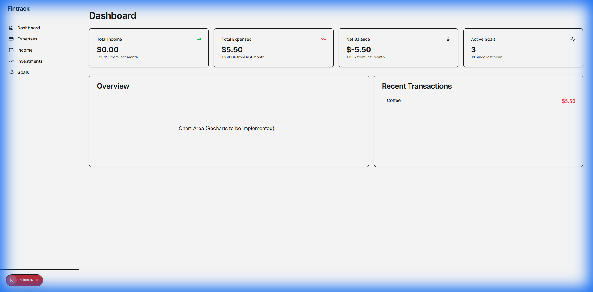
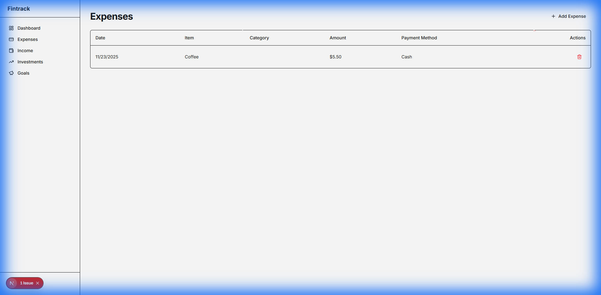

# Fintrack - Financial Tracking Application

Fintrack is a comprehensive, full-stack financial management application designed to help users take control of their finances. Built with a high-performance FastAPI backend and a dynamic Next.js frontend, Fintrack offers a seamless experience for tracking expenses, income, investments, and goals.



## 🚀 Key Features

*   **User Authentication**: Secure Signup and Login functionality using JWT tokens and password hashing (pbkdf2_sha256).
*   **Interactive Dashboard**: Get a bird's-eye view of your financial health with real-time summaries of total income, expenses, and net balance.
*   **Expense Management**: Easily add, view, and delete daily expenses. Categorize your spending to identify trends.
*   **Income Tracking**: Record various sources of income to keep your budget balanced.
*   **Investment Portfolio**: Track your stocks, crypto, and other assets. (Real-time data integration planned).
*   **Goal Setting**: Create "Piggy Banks" for your savings goals and track your progress visually.
*   **Responsive Design**: A modern, clean UI built with Tailwind CSS and Shadcn UI, featuring a dark/light mode theme.

## 🛠️ Tech Stack

### Backend
*   **Framework**: [FastAPI](https://fastapi.tiangolo.com/) (Python)
*   **Database**: SQLite (via [SQLAlchemy](https://www.sqlalchemy.org/))
*   **Authentication**: OAuth2 with Password Flow (JWT)
*   **Validation**: Pydantic

### Frontend
*   **Framework**: [Next.js 14](https://nextjs.org/) (App Router)
*   **Language**: TypeScript
*   **Styling**: Tailwind CSS
*   **UI Components**: [Shadcn UI](https://ui.shadcn.com/)
*   **Animations**: Framer Motion
*   **HTTP Client**: Axios

## 📋 Prerequisites

Before you begin, ensure you have the following installed:
*   **Python 3.8+**
*   **Node.js 18+**
*   **npm** or **yarn**

## ⚙️ Installation & Setup

### 1. Clone the Repository
```bash
git clone https://github.com/yourusername/fintrack.git
cd fintrack
```

### 2. Backend Setup
Navigate to the backend directory and set up the Python environment.

```bash
cd backend

# Create a virtual environment
python -m venv venv

# Activate the virtual environment
# Windows:
venv\Scripts\activate
# macOS/Linux:
# source venv/bin/activate

# Install dependencies
pip install -r requirements.txt
```

### 3. Frontend Setup
Navigate to the frontend directory and install Node.js dependencies.

```bash
cd ../frontend
npm install
```

## 🚀 Running the Application

You will need to run the backend and frontend servers simultaneously in separate terminal windows.

### Start the Backend
From the **root** directory of the project (important for imports to work correctly):

```bash
# Ensure your virtual environment is activated
# If not: backend\venv\Scripts\activate

uvicorn backend.main:app --reload
```
The API will be available at `http://localhost:8000`. You can view the interactive API docs at `http://localhost:8000/docs`.

### Start the Frontend
From the `frontend` directory:

```bash
cd frontend
npm run dev
```
The application will be running at `http://localhost:3000`.

## 📸 Screenshots

### Expenses Management


## 🤝 Contributing

Contributions are welcome! Please feel free to submit a Pull Request.

## 📄 License

This project is licensed under the MIT License.